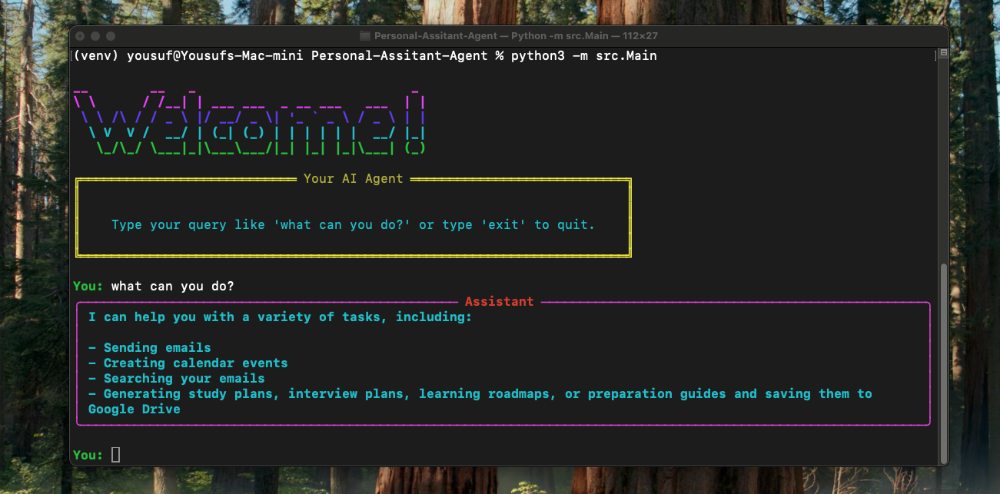

# **AI Agent CLI – Personal Assistant Agent**

A terminal-based AI Agent built with **LangChain**, **Google Gemini 2.5 Pro**, and Google Workspace APIs.
This assistant can generate study or interview preparation plans, interact with Gmail, upload files to Google Drive, and more — all through a clean **CLI interface**.

<p align="center">
  
</p>

---

## 🚀 **Features**

### **✓ Intelligent Plan Generation**

* Creates personalized study plans.
* Generates custom interview preparation outlines.
* Outputs can be stored directly in Google Drive.

### **✓ Email Automation**

* Sends emails using your Gmail account.
* Searches your inbox using keyword-based queries.
* Extracts summaries and relevant information from email threads.

### **✓ Google Drive Integration**

* Uploads generated files to Drive.
* Allows Drive-based workflows through the agent.

### **✓ Google Calender**

* Can create calendar events with or without invited participants.

### **✓ CLI Interface**

* Simple and intuitive command-line experience.
* No web UI or additional desktop software needed.

### **✓ LLM Reasoning with Gemini 2.5 Pro**

* Integrated with LangChain’s agent framework.
* Dynamically calls tools such as search, send email, or upload to Drive based on intent.

---

## 🛠 **Tech Stack**

| Component                 | Description    |
| ------------------------- | -------------- |
| **Python 3.10+**          | Main runtime   |
| **LangChain**             | Agent + Tools  |
| **Google Gemini 2.5 Pro** | LLM model      |
| **Google Workspace APIs** | Gmail + Drive  |
| **OAuth 2.0**             | Authentication |
| **Rich**                  | CLI styling    |

---

## 📦 **Installation**

### **1. Clone the Repository**

```bash
git clone https://github.com/your-username/your-repo.git
cd your-repo
```

### **2. Create Virtual Environment**

```bash
python3 -m venv venv
source venv/bin/activate       # macOS / Linux
venv\Scripts\activate          # Windows
```

### **3. Install Dependencies**

```bash
pip install -r requirements.txt
```

Minimal example for `requirements.txt`:

```txt
langchain
google-generativeai
google-auth
google-auth-oauthlib
google-api-python-client
python-dotenv
rich
```

---

## 🔐 **Google OAuth Setup (Required)**

This project **requires a `credentials.json`** file downloaded from Google Cloud Console.

### **Steps:**

#### 1. Open Credential Creation Guide

Official Google guide:
[https://developers.google.com/workspace/guides/create-credentials](https://developers.google.com/workspace/guides/create-credentials)

#### 2. Configure OAuth Consent Screen

Required before you can create OAuth client credentials.

#### 3. Create OAuth Client ID

* Application type: **Desktop App**

#### 4. Download JSON File

After creating the OAuth client, click **Download JSON**.

#### 5. Place the File in the Required Folder

Your project must contain:

```
creds/credentials.json
```

The application loads OAuth credentials from this file.

---

## 🔑 **Environment Variables**

Only **one** environment variable is required:

```env
GOOGLE_API_KEY=your_gemini_2_5_pro_api_key
```

This API key is used **only** for Gemini 2.5 Pro calls.

---

## 📁 **Project Structure**

This README follows **your exact structure**, as provided:

```
src/
├── agent/
│   ├── __init__.py
│   └── PersonalAssistantAgent.py
│
├── service/
│   ├── __init__.py
│   └── GoogleService.py
│
├── tools/
│   ├── __init__.py
│   └── AgentTools.py
│
└── Main.py
```

Additionally, you must manually create:

```
creds/
└── credentials.json
```
---

## ▶️ **Running the Application**

To start the CLI:

```bash
python -m src.Main.py
```

---

## 🧩 **Future Enhancements**
* Voice command integration
* Automated multi-step workflows
* Optional FastAPI dashboard

---

## 📜 **License**

MIT License or any license you choose.

---
